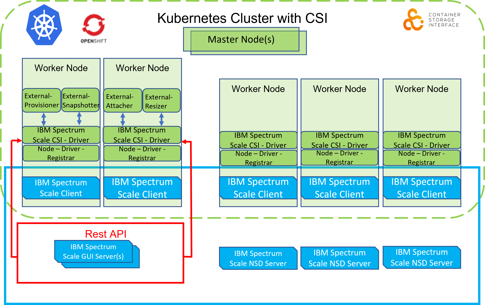

IBM Spectrum Scale 是一个集群文件系统，它提供从多个节点对单个文件系统或一组文件系统的并发访问。这些节点可以是 SAN 连接的、网络连接的、SAN和网络连接的混合，或者是SNC（shared nothing cluster）集群配置。这可以实现对通用数据集的高性能访问，以支持横向扩展或提供高可用性。

容器存储接口 (CSI) 是一种标准，用于将任意块和文件存储系统暴露给 Kubernetes 等容器编排系统上的容器化工作负载。 
<!--more-->

IBM Spectrum Scale CSI Driver允许 IBM Spectrum Scale 用作在 Kubernetes 集群中运行的有状态应用程序的持久存储。通过 IBM Spectrum Scale Container Storage Interface 驱动程序，可以从 IBM Spectrum Scale 供应 Kubernetes 持久卷 (PV)。



IBM通过以下方式实现存储插件的 CSI 规范：

external-provisioner、external-snapshotter、external-attacher 和 external-resizer Sidecar Containers 是 StatefulSet，它们可以部署在不同的基础设施主机上以实现弹性：
- external-provisioner 监视创建和删除卷 API 。
- external-snapshotter 监视创建和删除卷快照。
- external-attacher 监视挂载和卸载 API。
- external-resizer 监视卷扩展。

node-driver-registrar 是一个 kubelet 服务，在初始化时与 node 插件一起运行。 IBM Spectrum Scale Container Storage Interface 驱动程序为从容器工作节点到底层存储系统的持久卷挂载提供互连，并部署为 DaemonSet。

IBM Spectrum Scale Container Storage Interface 驱动程序对 IBM Spectrum Scale 存储系统进行 REST API 调用以执行存储管理功能。

## Driver
在main.go中首先要kubelet plugin文件夹中创建两个文件夹：
- plugins/spectrumscale.csi.ibm.com/controller
- plugins/spectrumscale.csi.ibm.com/node

由于历史原因，还需要将老版本的目录从kubelet目录中删除：
- remove all in plugins/ibm-spectrum-scale-csi

然后调用`driver.GetScaleDriver()`创建Driver实例：
```
func GetScaleDriver() *ScaleDriver {
	glog.V(3).Infof("gpfs GetScaleDriver")
	return &ScaleDriver{}
}
```

### Driver Config
并调用`driver.SetupScaleDriver(*driverName, vendorVersion, *nodeID)` 配置该实例：
- driverName: `spectrumscale.csi.ibm.com`
- nodeid: 命令行传入
- vendorVersion： CSI版本号

```
type ScaleDriver struct {
	name          string
	vendorVersion string
	nodeID        string

	ids *ScaleIdentityServer
	ns  *ScaleNodeServer
	cs  *ScaleControllerServer

	connmap map[string]connectors.SpectrumScaleConnector
	cmap    settings.ScaleSettingsConfigMap
	primary settings.Primary
	reqmap  map[string]int64

	snapjobstatusmap    sync.Map
	volcopyjobstatusmap sync.Map

	// clusterMap map stores the cluster name as key and cluster details as value.
	clusterMap sync.Map

	vcap  []*csi.VolumeCapability_AccessMode
	cscap []*csi.ControllerServiceCapability
	nscap []*csi.NodeServiceCapability
}
```

SetupScaleDriver主要负责：
1. 设置driver name，version和nodeID
2. 初始化Driver：
  - 2.1 从`csi.VolumeCapability_AccessMode_MULTI_NODE_MULTI_WRITER`读取配置文件，并将Secret/cert等读取并解析
  - 2.2 验证读取到的配置文件
    - 2.2.1  len(scaleConfig.Clusters) > 0
    - 2.2.2  每个cluster中必须有： ID, RestAPI，GuiHost，secret
    - 2.2.3 只能有一个cluster具有primary 字段，primary字段中必须含有primaryFS或者primaryFSDep
  - 2.3 为配置文件中的每一个cluster生成一个connector，可用于连接scale cluster。
  - 2.5 调用`scalemgmt/v2/cluster`接口获取真正的ClusterId，并将其与配置文件中的clusterid对比，如果不对则报错。
  - 2.6 创建connector map，其key为cluster id，value为对应cluster的connector。
  - 2.7 对于primary cluster，增加一个key为primary的k-v。并使用API`scalemgmt/v2/filesystems/`获取配置文件中PrimaryFS/PrimaryFSDep的详细信息，并判断该FS是否已经Mounted，如果还没有，则报错。
  - 2.8 通过获取到FS的详细信息，完善配置文件中的内容，例如primaryFSMount path和Primary的clusterid。并通过详细信息中的RemoteDeviceName获取Primary的FS name。
  - 2.9 使用`scalemgmt/v2/filesystems/%s/filesets/%s`获取PrimaryFS中的FSSet信息。如果不存在，则创建新的，如果存在但是linkpath为空，则调用`scalemgmt/v2/filesystems/%s/filesets/%s/link`重新link。
  - 2.10 如果config中的PrimaryFSMount和真实的fsmount不一样，则创建linkpath
3. 设置创建volume的accessmode：csi.VolumeCapability_AccessMode_MULTI_NODE_MULTI_WRITER
4. 设置Controller Service Capability
  - 3.1 csi.ControllerServiceCapability_RPC_CREATE_DELETE_VOLUME,
  - 3.2 csi.ControllerServiceCapability_RPC_PUBLISH_UNPUBLISH_VOLUME,
  - 3.3 csi.ControllerServiceCapability_RPC_CREATE_DELETE_SNAPSHOT,
  - 3.4 csi.ControllerServiceCapability_RPC_EXPAND_VOLUME,
  - 3.5 csi.ControllerServiceCapability_RPC_CLONE_VOLUME,
4. 设置Node Service Capability
  - 不支持任何的Node Capability
5. 设置Indetity Server，Node Server和ControllerServer

```
func (driver *ScaleDriver) SetupScaleDriver(name, vendorVersion, nodeID string) error {
	glog.V(3).Infof("gpfs SetupScaleDriver. name: %s, version: %v, nodeID: %s", name, vendorVersion, nodeID)
	if name == "" {
		return fmt.Errorf("Driver name missing")
	}

	scmap, cmap, primary, err := driver.PluginInitialize()
	if err != nil {
		glog.Errorf("Error in plugin initialization: %s", err)
		return err
	}

	driver.name = name
	driver.vendorVersion = vendorVersion
	driver.nodeID = nodeID

	// Adding Capabilities
	vcam := []csi.VolumeCapability_AccessMode_Mode{
		csi.VolumeCapability_AccessMode_MULTI_NODE_MULTI_WRITER,
	}
	_ = driver.AddVolumeCapabilityAccessModes(vcam)

	csc := []csi.ControllerServiceCapability_RPC_Type{
		csi.ControllerServiceCapability_RPC_CREATE_DELETE_VOLUME,
		csi.ControllerServiceCapability_RPC_PUBLISH_UNPUBLISH_VOLUME,
		csi.ControllerServiceCapability_RPC_CREATE_DELETE_SNAPSHOT,
		csi.ControllerServiceCapability_RPC_EXPAND_VOLUME,
		csi.ControllerServiceCapability_RPC_CLONE_VOLUME,
	}
	_ = driver.AddControllerServiceCapabilities(csc)

	ns := []csi.NodeServiceCapability_RPC_Type{}
	_ = driver.AddNodeServiceCapabilities(ns)

	driver.ids = NewIdentityServer(driver)
	driver.ns = NewNodeServer(driver)
	driver.cs = NewControllerServer(driver, scmap, cmap, primary)
	return nil
}
```

#### Identity Server
CSI 要求Identity Server提供三个接口，GetPluginInfo, GetPluginCapabilities, Probe。

- GetPluginInfo只会返回DriverName和Versin
- GetPluginCapabilities只会返回csi.PluginCapability_Service_CONTROLLER_SERVICE表明该CSI只支持Controller功能
- Probe会调用Primary cluster的`scalemgmt/v2/nodes/%s/health/states?filter=state=HEALTHY,entityType=NODE,component=GPFS`接口判断Node Component的健康状态。

#### Node Server

Node server 必须实现三个接口：
- NodeGetCapabilities： 返回空
- NodePublishVolume：
  - 从volumeID获取Path
  - 检查`/host`path是否存在
    - 如果不存在（则symlink），并且request中的targetpath存在，则将targetpath删除。如果targetpath不存在，则创建一个targetpath link指向volumeID中获取的Path
    - 如果存在（则bind mound），并且targetPath不存在，则直接创建targetpath。如果targetPath存在并且是一个MountPoint，则将volumeID中获取的Path挂载到targetPath
- NodeUnpublishVolume：
  - target 如果是symlink，则直接删除
  - 如果taget不是symlink，并且是mountpoiny，则直接将其unmount。

scale实现的其余接口：
- NodeGetInfo： 返回nodeid
- NodeExpandVolume: 返回Unimplemented
- NodeGetVolumeStats：返回Unimplemented
- NodeUnstageVolume：没有实现具体功能
- NodeStageVolume：没有实现具体功能
#### Controller Server

Scale实现了如下controller server接口：
- ControllerGetCapabilities：
  - CREATE_DELETE_VOLUME,
  - PUBLISH_UNPUBLISH_VOLUME,
  - CREATE_DELETE_SNAPSHOT,
  - EXPAND_VOLUME,
  - CLONE_VOLUME,
- CreateVolume: 
- DeleteVolume:
- ListVolumes: 返回Unimplemented
- ControllerGetVolume: 返回Unimplemented
- ValidateVolumeCapabilities: 只检查access mode必须是MULTI_NODE_MULTI_WRITER，其余直接返回Confirmed
- ControllerPublishVolume: 调用`PUT scalemgmt/v2/filesystems/%s/mount` mount FS
- ControllerUnPublishVolume: 没有实现具体功能
- CreateSnapshot：调用`POST scalemgmt/v2/filesystems/%s/filesets/%s/snapshots/%s`创建snapshot
- DeleteSnapshot：调用`DELETE scalemgmt/v2/filesystems/%s/filesets/%s/snapshots/%s`删除snapshot
- ListSnapshots: 返回Unimplemented
- GetCapacity: 返回Unimplemented
- ControllerExpandVolume: 调用`"scalemgmt/v2/filesystems/%s/quotas"`接口扩展fileset的quota。
### Driver Run
配置好Driver之后就是运行该Driver。首先Driver会启动一个GRPC Server，监听`unix://tmp/csi.sock`
```
func (driver *ScaleDriver) Run(endpoint string) {
	glog.Infof("Driver: %v version: %v", driver.name, driver.vendorVersion)
	s := NewNonBlockingGRPCServer()
	s.Start(endpoint, driver.ids, driver.cs, driver.ns)
	s.Wait()
}
```


Start 方法会启用一个routine执行serve方法，并在外面调用s.Wait()阻塞。
```
func (s *nonBlockingGRPCServer) Start(endpoint string, ids csi.IdentityServer, cs csi.ControllerServer, ns csi.NodeServer) {
	s.wg.Add(1)

	go s.serve(endpoint, ids, cs, ns)
}
```

```

func (s *nonBlockingGRPCServer) serve(endpoint string, ids csi.IdentityServer, cs csi.ControllerServer, ns csi.NodeServer) {
	opts := []grpc.ServerOption{
		grpc.UnaryInterceptor(logGRPC),
	}

	u, err := url.Parse(endpoint)

	if err != nil {
		glog.Fatal(err.Error())
	}

	var addr string
	if u.Scheme == "unix" {
		addr = u.Path
		if err := os.Remove(addr); err != nil && !os.IsNotExist(err) {
			glog.Fatalf("Failed to remove %s, error: %s", addr, err.Error())
		}
	} else if u.Scheme == "tcp" {
		addr = u.Host
	} else {
		glog.Fatalf("%v endpoint scheme not supported", u.Scheme)
	}

	glog.V(4).Infof("Start listening with scheme %v, addr %v", u.Scheme, addr)
	listener, err := net.Listen(u.Scheme, addr)
	if err != nil {
		glog.Fatalf("Failed to listen: %v", err)
	}

	server := grpc.NewServer(opts...)
	s.server = server

	if ids != nil {
		csi.RegisterIdentityServer(server, ids)
	}
	if cs != nil {
		csi.RegisterControllerServer(server, cs)
	}
	if ns != nil {
		csi.RegisterNodeServer(server, ns)
	}

	glog.V(4).Infof("Listening for connections on address: %#v", listener.Addr())

	if err := server.Serve(listener); err != nil {
		glog.Fatalf("Failed to serve: %v", err)
	}
}
```

serve方法中主要进行：
- 启动grpc server
- 向grpc server中注册IdentityServer，ControllerServer和NodeServer。