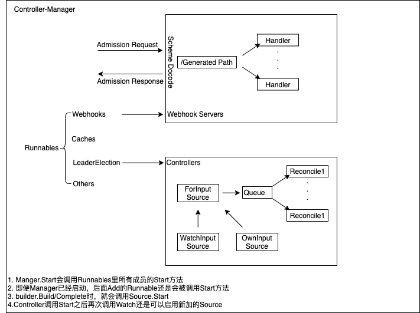

Kubernetes Controller Runtime是用来构建Controller的一系列go lib。它主要被Kubebuilder和Operator SDK所使用。

本文主要集中讨论Controller的源码实现

<!--more-->

## Controller

Controller管理一个Work Queue， source.Sources 生成的 reconcile.Requests 会不断的加入到该 Work Queue 中。 每个入队的成员会触发reconcile.Reconciler 执行工作。执行的工作通常是读写 Kubernetes 对象以使系统状态与对象 Spec 中指定的状态相匹配。

### Interface

所以一个Controller需要提供如下接口：
```
type Controller interface {
	// Reconciler 是需要执行的Work
	reconcile.Reconciler

	// Watch 接受 Source 提供的Event并使用 EventHandler 将 reconcile.Requests 压入队列以响应事件
	// Watch 可能会提供一个或者多个的Predicates用来在使用EventHandler之前过滤事件
	Watch(src source.Source, eventhandler handler.EventHandler, predicates ...predicate.Predicate) error

	// 启动 controller.
	Start(ctx context.Context) error

	// GetLogger 获取一个预先设定基本信息的logger
	GetLogger() logr.Logger
}
```

### Implement

Controller 的实例包含以下字段：
```
type Controller struct {
	// Controller的名字, Name is required.
	Name string

	// MaxConcurrentReconciles 表示Reconcile能够并发执行的最大数量. Defaults to 1.
	MaxConcurrentReconciles int

	// Reconciler 函数.
	Do reconcile.Reconciler

    // MakeQueue用来构建Controller使用的Queue。
	MakeQueue func() workqueue.RateLimitingInterface

	// Queue is an listeningQueue that listens for events from Informers and adds object keys to
	// the Queue for processing
	Queue workqueue.RateLimitingInterface

	// SetFields is used to inject dependencies into other objects such as Sources, EventHandlers and Predicates
	// Deprecated: the caller should handle injected fields itself.
	SetFields func(i interface{}) error

	// mu is used to synchronize Controller setup
	mu sync.Mutex

	// Started is true if the Controller has been Started
	Started bool

	// ctx is the context that was passed to Start() and used when starting watches.
	//
	// According to the docs, contexts should not be stored in a struct: https://golang.org/pkg/context,
	// while we usually always strive to follow best practices, we consider this a legacy case and it should
	// undergo a major refactoring and redesign to allow for context to not be stored in a struct.
	ctx context.Context

	// CacheSyncTimeout refers to the time limit set on waiting for cache to sync
	// Defaults to 2 minutes if not set.
	CacheSyncTimeout time.Duration

	// startWatches maintains a list of sources, handlers, and predicates to start when the controller is started.
	startWatches []watchDescription

	// LogConstructor is used to construct a logger to then log messages to users during reconciliation,
	// or for example when a watch is started.
	// Note: LogConstructor has to be able to handle nil requests as we are also using it
	// outside the context of a reconciliation.
	LogConstructor func(request *reconcile.Request) logr.Logger

	// RecoverPanic indicates whether the panic caused by reconcile should be recovered.
	RecoverPanic bool
}
```

接下来我们看下该实现所具有的Controller接口：

#### Reconcile

Controller.Reconcile的主要内容就是调用Do.Reconcile. 如果有Panic，则根据配置决定是否Recover。

```
func (c *Controller) Reconcile(ctx context.Context, req reconcile.Request) (_ reconcile.Result, err error) {
	defer func() {
		if r := recover(); r != nil {
			if c.RecoverPanic {
				for _, fn := range utilruntime.PanicHandlers {
					fn(r)
				}
				err = fmt.Errorf("panic: %v [recovered]", r)
				return
			}

			log := logf.FromContext(ctx)
			log.Info(fmt.Sprintf("Observed a panic in reconciler: %v", r))
			panic(r)
		}
	}()
	return c.Do.Reconcile(ctx, req)
}
```

#### Watch

Controller.Watch会：
- 先对Source，Eventhandler，Predicate分别调用controller.SetFields。
- 如果Controller还未启动，则将Source，Eventhandler，Predicate加入到startWatches列表中。
- 如果Controller已经启动，则调用src.Start方法。用以将EventHandle注册到Informer，从而向队列中压入reconcile.Request
```
func (c *Controller) Watch(src source.Source, evthdler handler.EventHandler, prct ...predicate.Predicate) error {
	c.mu.Lock()
	defer c.mu.Unlock()

	// Inject Cache into arguments
	if err := c.SetFields(src); err != nil {
		return err
	}
	if err := c.SetFields(evthdler); err != nil {
		return err
	}
	for _, pr := range prct {
		if err := c.SetFields(pr); err != nil {
			return err
		}
	}

	// Controller hasn't started yet, store the watches locally and return.
	//
	// These watches are going to be held on the controller struct until the manager or user calls Start(...).
	if !c.Started {
		c.startWatches = append(c.startWatches, watchDescription{src: src, handler: evthdler, predicates: prct})
		return nil
	}

	c.LogConstructor(nil).Info("Starting EventSource", "source", src)
	return src.Start(c.ctx, evthdler, c.Queue, prct...)
}
```

#### Start

Controller.Start 方法会启动该Controller，其本质上的工作可总结为：
1. 调用MakeQueue()创建一个共享的Queue
2. 遍历startWatches中的成员，并调用所有成员的Start方法，即所有Source的Start方法
3. 遍历startWatches中的成员，并调用所有成员的WaitForSync方法，判断Source是否已经同步完成
4. 启动MaxConcurrentReconciles个rotine，在内部不断的调用processNextWorkItem
5. processNextWorkItem实际上就是从Queue中获取reconcile.Request，并调用Controller的Reconcile方法。完成之后，调用c.Queue.Done(obj)告知Queue该成员已经被完成。
6. Reconcile方法不同的返回结果会触发不同的动作
  - 有error: 调用AddRateLimited重新requeue
  - result.RequeueAfter > 0: 先调用Queue.Forget然后调用Queue.AddAfter重新requeue
  - result.Requeue == true: 调用AddRateLimited重新requeue
  - default: 调用Queue.Forget不在将其requeue
```
// Start implements controller.Controller.
func (c *Controller) Start(ctx context.Context) error {
	// use an IIFE to get proper lock handling
	// but lock outside to get proper handling of the queue shutdown
	c.mu.Lock()
	if c.Started {
		return errors.New("controller was started more than once. This is likely to be caused by being added to a manager multiple times")
	}

	c.initMetrics()

	// Set the internal context.
	c.ctx = ctx

	c.Queue = c.MakeQueue()
	go func() {
		<-ctx.Done()
		c.Queue.ShutDown()
	}()

	wg := &sync.WaitGroup{}
	err := func() error {
		defer c.mu.Unlock()

		// TODO(pwittrock): Reconsider HandleCrash
		defer utilruntime.HandleCrash()

		// NB(directxman12): launch the sources *before* trying to wait for the
		// caches to sync so that they have a chance to register their intendeded
		// caches.
		for _, watch := range c.startWatches {
			c.LogConstructor(nil).Info("Starting EventSource", "source", fmt.Sprintf("%s", watch.src))

			if err := watch.src.Start(ctx, watch.handler, c.Queue, watch.predicates...); err != nil {
				return err
			}
		}

		// Start the SharedIndexInformer factories to begin populating the SharedIndexInformer caches
		c.LogConstructor(nil).Info("Starting Controller")

		for _, watch := range c.startWatches {
			syncingSource, ok := watch.src.(source.SyncingSource)
			if !ok {
				continue
			}

			if err := func() error {
				// use a context with timeout for launching sources and syncing caches.
				sourceStartCtx, cancel := context.WithTimeout(ctx, c.CacheSyncTimeout)
				defer cancel()

				// WaitForSync waits for a definitive timeout, and returns if there
				// is an error or a timeout
				if err := syncingSource.WaitForSync(sourceStartCtx); err != nil {
					err := fmt.Errorf("failed to wait for %s caches to sync: %w", c.Name, err)
					c.LogConstructor(nil).Error(err, "Could not wait for Cache to sync")
					return err
				}

				return nil
			}(); err != nil {
				return err
			}
		}

		// All the watches have been started, we can reset the local slice.
		//
		// We should never hold watches more than necessary, each watch source can hold a backing cache,
		// which won't be garbage collected if we hold a reference to it.
		c.startWatches = nil

		// Launch workers to process resources
		c.LogConstructor(nil).Info("Starting workers", "worker count", c.MaxConcurrentReconciles)
		wg.Add(c.MaxConcurrentReconciles)
		for i := 0; i < c.MaxConcurrentReconciles; i++ {
			go func() {
				defer wg.Done()
				// Run a worker thread that just dequeues items, processes them, and marks them done.
				// It enforces that the reconcileHandler is never invoked concurrently with the same object.
				for c.processNextWorkItem(ctx) {
				}
			}()
		}

		c.Started = true
		return nil
	}()
	if err != nil {
		return err
	}

	<-ctx.Done()
	c.LogConstructor(nil).Info("Shutdown signal received, waiting for all workers to finish")
	wg.Wait()
	c.LogConstructor(nil).Info("All workers finished")
	return nil
}

// processNextWorkItem will read a single work item off the workqueue and
// attempt to process it, by calling the reconcileHandler.
func (c *Controller) processNextWorkItem(ctx context.Context) bool {
	obj, shutdown := c.Queue.Get()
	if shutdown {
		// Stop working
		return false
	}

	// We call Done here so the workqueue knows we have finished
	// processing this item. We also must remember to call Forget if we
	// do not want this work item being re-queued. For example, we do
	// not call Forget if a transient error occurs, instead the item is
	// put back on the workqueue and attempted again after a back-off
	// period.
	defer c.Queue.Done(obj)

	ctrlmetrics.ActiveWorkers.WithLabelValues(c.Name).Add(1)
	defer ctrlmetrics.ActiveWorkers.WithLabelValues(c.Name).Add(-1)

	c.reconcileHandler(ctx, obj)
	return true
}

func (c *Controller) reconcileHandler(ctx context.Context, obj interface{}) {
	// Update metrics after processing each item
	reconcileStartTS := time.Now()
	defer func() {
		c.updateMetrics(time.Since(reconcileStartTS))
	}()

	// Make sure that the object is a valid request.
	req, ok := obj.(reconcile.Request)
	if !ok {
		// As the item in the workqueue is actually invalid, we call
		// Forget here else we'd go into a loop of attempting to
		// process a work item that is invalid.
		c.Queue.Forget(obj)
		c.LogConstructor(nil).Error(nil, "Queue item was not a Request", "type", fmt.Sprintf("%T", obj), "value", obj)
		// Return true, don't take a break
		return
	}

	log := c.LogConstructor(&req)

	log = log.WithValues("reconcileID", uuid.NewUUID())
	ctx = logf.IntoContext(ctx, log)

	// RunInformersAndControllers the syncHandler, passing it the Namespace/Name string of the
	// resource to be synced.
	result, err := c.Reconcile(ctx, req)
	switch {
	case err != nil:
		c.Queue.AddRateLimited(req)
		ctrlmetrics.ReconcileErrors.WithLabelValues(c.Name).Inc()
		ctrlmetrics.ReconcileTotal.WithLabelValues(c.Name, labelError).Inc()
		log.Error(err, "Reconciler error")
	case result.RequeueAfter > 0:
		// The result.RequeueAfter request will be lost, if it is returned
		// along with a non-nil error. But this is intended as
		// We need to drive to stable reconcile loops before queuing due
		// to result.RequestAfter
		c.Queue.Forget(obj)
		c.Queue.AddAfter(req, result.RequeueAfter)
		ctrlmetrics.ReconcileTotal.WithLabelValues(c.Name, labelRequeueAfter).Inc()
	case result.Requeue:
		c.Queue.AddRateLimited(req)
		ctrlmetrics.ReconcileTotal.WithLabelValues(c.Name, labelRequeue).Inc()
	default:
		// Finally, if no error occurs we Forget this item so it does not
		// get queued again until another change happens.
		c.Queue.Forget(obj)
		ctrlmetrics.ReconcileTotal.WithLabelValues(c.Name, labelSuccess).Inc()
	}
}
```

#### GetLogger
GetLogger方法就是调用Controller的成员LogConstructor新建一个Logger。

```
// GetLogger returns this controller's logger.
func (c *Controller) GetLogger() logr.Logger {
	return c.LogConstructor(nil)
}
```

#### New

Controller使用Options做实例创建:
```
type Options struct {
	// MaxConcurrentReconciles is the maximum number of concurrent Reconciles which can be run. Defaults to 1.
	MaxConcurrentReconciles int

	// Reconciler reconciles an object
	Reconciler reconcile.Reconciler

	// RateLimiter is used to limit how frequently requests may be queued.
	// Defaults to MaxOfRateLimiter which has both overall and per-item rate limiting.
	// The overall is a token bucket and the per-item is exponential.
	RateLimiter ratelimiter.RateLimiter

	// LogConstructor is used to construct a logger used for this controller and passed
	// to each reconciliation via the context field.
	LogConstructor func(request *reconcile.Request) logr.Logger

	// CacheSyncTimeout refers to the time limit set to wait for syncing caches.
	// Defaults to 2 minutes if not set.
	CacheSyncTimeout time.Duration

	// RecoverPanic indicates whether the panic caused by reconcile should be recovered.
	RecoverPanic bool
}
```

调用NewUnmanaged可以创建一个不受Manager管理的Controller，其中值得注意的是：
- 使用workqueue.NewNamedRateLimitingQueue(options.RateLimiter, name)函数作为Queue的构造函数
- 使用mgr.SetFields作为Controller的SetFields方法
- 其余字段基本都是直接从Option中Copy
- 此时还没有设置Controller的startWatches列表
```
// NewUnmanaged returns a new controller without adding it to the manager. The
// caller is responsible for starting the returned controller.
func NewUnmanaged(name string, mgr manager.Manager, options Options) (Controller, error) {
	if options.Reconciler == nil {
		return nil, fmt.Errorf("must specify Reconciler")
	}

	if len(name) == 0 {
		return nil, fmt.Errorf("must specify Name for Controller")
	}

	if options.LogConstructor == nil {
		log := mgr.GetLogger().WithValues(
			"controller", name,
		)
		options.LogConstructor = func(req *reconcile.Request) logr.Logger {
			log := log
			if req != nil {
				log = log.WithValues(
					"object", klog.KRef(req.Namespace, req.Name),
					"namespace", req.Namespace, "name", req.Name,
				)
			}
			return log
		}
	}

	if options.MaxConcurrentReconciles <= 0 {
		options.MaxConcurrentReconciles = 1
	}

	if options.CacheSyncTimeout == 0 {
		options.CacheSyncTimeout = 2 * time.Minute
	}

	if options.RateLimiter == nil {
		options.RateLimiter = workqueue.DefaultControllerRateLimiter()
	}

	// Inject dependencies into Reconciler
	if err := mgr.SetFields(options.Reconciler); err != nil {
		return nil, err
	}

	// Create controller with dependencies set
	return &controller.Controller{
		Do: options.Reconciler,
		MakeQueue: func() workqueue.RateLimitingInterface {
			return workqueue.NewNamedRateLimitingQueue(options.RateLimiter, name)
		},
		MaxConcurrentReconciles: options.MaxConcurrentReconciles,
		CacheSyncTimeout:        options.CacheSyncTimeout,
		SetFields:               mgr.SetFields,
		Name:                    name,
		LogConstructor:          options.LogConstructor,
		RecoverPanic:            options.RecoverPanic,
	}, nil
}
```

## Builer
Kubebuilder为了方便的使用Controller，在其之上构建了一个新的结构体，位于`controller-runtime/pkg/builder/controller.go`：
```
type Builder struct {
	forInput         ForInput
	ownsInput        []OwnsInput
	watchesInput     []WatchesInput
	mgr              manager.Manager
	globalPredicates []predicate.Predicate
	ctrl             controller.Controller
	ctrlOptions      controller.Options
	name             string
}
```
### ForInput

ForInput定义了Reconciled的Object类型:

type ForInput struct {
	object           client.Object
	predicates       []predicate.Predicate
	objectProjection objectProjection
	err              error
}

// For defines the type of Object being *reconciled*, and configures the ControllerManagedBy to respond to create / delete /
// update events by *reconciling the object*.
// This is the equivalent of calling
// Watches(&source.Kind{Type: apiType}, &handler.EnqueueRequestForObject{}).
func (blder *Builder) For(object client.Object, opts ...ForOption) *Builder {
	if blder.forInput.object != nil {
		blder.forInput.err = fmt.Errorf("For(...) should only be called once, could not assign multiple objects for reconciliation")
		return blder
	}
	input := ForInput{object: object}
	for _, opt := range opts {
		opt.ApplyToFor(&input)
	}

	blder.forInput = input
	return blder
}

### OwnsInput
OwnsInput定义了需要将其Owner进行Recocile的Object

// OwnsInput represents the information set by Owns method.
type OwnsInput struct {
	object           client.Object
	predicates       []predicate.Predicate
	objectProjection objectProjection
}

// Owns defines types of Objects being *generated* by the ControllerManagedBy, and configures the ControllerManagedBy to respond to
// create / delete / update events by *reconciling the owner object*.  This is the equivalent of calling
// Watches(&source.Kind{Type: <ForType-forInput>}, &handler.EnqueueRequestForOwner{OwnerType: apiType, IsController: true}).
func (blder *Builder) Owns(object client.Object, opts ...OwnsOption) *Builder {
	input := OwnsInput{object: object}
	for _, opt := range opts {
		opt.ApplyToOwns(&input)
	}

	blder.ownsInput = append(blder.ownsInput, input)
	return blder
}

### WatchesInput

WatchesInput同OwnsInput和Forinput一样，只不过是比这两种更低层级的表达方式。

```
// WatchesInput represents the information set by Watches method.
type WatchesInput struct {
	src              source.Source
	eventhandler     handler.EventHandler
	predicates       []predicate.Predicate
	objectProjection objectProjection
}

// Watches exposes the lower-level ControllerManagedBy Watches functions through the builder.  Consider using
// Owns or For instead of Watches directly.
// Specified predicates are registered only for given source.
func (blder *Builder) Watches(src source.Source, eventhandler handler.EventHandler, opts ...WatchesOption) *Builder {
	input := WatchesInput{src: src, eventhandler: eventhandler}
	for _, opt := range opts {
		opt.ApplyToWatches(&input)
	}

	blder.watchesInput = append(blder.watchesInput, input)
	return blder
}
```

### GlobalPredicates
GlobalPredicates会设置全局的EventFilter

```
// WithEventFilter sets the event filters, to filter which create/update/delete/generic events eventually
// trigger reconciliations.  For example, filtering on whether the resource version has changed.
// Given predicate is added for all watched objects.
// Defaults to the empty list.
func (blder *Builder) WithEventFilter(p predicate.Predicate) *Builder {
	blder.globalPredicates = append(blder.globalPredicates, p)
	return blder
}
```

### Ctrl & CtrlOptions
Ctrl 和 CtrlOptions就是前文所讨论的Controller和创建其的Option。 Build使用Complete(reconciler)方法构建Controller：
```
// Complete builds the Application Controller.
func (blder *Builder) Complete(r reconcile.Reconciler) error {
	_, err := blder.Build(r)
	return err
}
```
```

// Build builds the Application Controller and returns the Controller it created.
func (blder *Builder) Build(r reconcile.Reconciler) (controller.Controller, error) {
	if r == nil {
		return nil, fmt.Errorf("must provide a non-nil Reconciler")
	}
	if blder.mgr == nil {
		return nil, fmt.Errorf("must provide a non-nil Manager")
	}
	if blder.forInput.err != nil {
		return nil, blder.forInput.err
	}
	// Checking the reconcile type exist or not
	if blder.forInput.object == nil {
		return nil, fmt.Errorf("must provide an object for reconciliation")
	}

	// Set the ControllerManagedBy
	if err := blder.doController(r); err != nil {
		return nil, err
	}

	// Set the Watch
	if err := blder.doWatch(); err != nil {
		return nil, err
	}

	return blder.ctrl, nil
}
```

Build方法主要调用：
- doController：用于创建前文所提到的Controller结构体，并将其注册到Manager中。注意，此时还未新建Source
- doWatch：
  - 使用forInput的Type配置Source，并将globalPredicates与forInput中的predicates结合，启动该source
  - 遍历ownsInput，使用ownsInput的type配置Source，并将globalPredicates与ownsInput中的predicates结合，使用`EnqueueRequestForOwner`启动该source
  - 遍历watchesInput，使用watchesInput的type配置Source，并将globalPredicates与watchesInput中的predicates结合，使用`watchesInput.eventhandler`启动该source

注意，此时Controller还并未启动。

```
func (blder *Builder) doController(r reconcile.Reconciler) error {
	globalOpts := blder.mgr.GetControllerOptions()

	ctrlOptions := blder.ctrlOptions
	if ctrlOptions.Reconciler == nil {
		ctrlOptions.Reconciler = r
	}

	// Retrieve the GVK from the object we're reconciling
	// to prepopulate logger information, and to optionally generate a default name.
	gvk, err := getGvk(blder.forInput.object, blder.mgr.GetScheme())
	if err != nil {
		return err
	}

	// Setup concurrency.
	if ctrlOptions.MaxConcurrentReconciles == 0 {
		groupKind := gvk.GroupKind().String()

		if concurrency, ok := globalOpts.GroupKindConcurrency[groupKind]; ok && concurrency > 0 {
			ctrlOptions.MaxConcurrentReconciles = concurrency
		}
	}

	// Setup cache sync timeout.
	if ctrlOptions.CacheSyncTimeout == 0 && globalOpts.CacheSyncTimeout != nil {
		ctrlOptions.CacheSyncTimeout = *globalOpts.CacheSyncTimeout
	}

	controllerName := blder.getControllerName(gvk)

	// Setup the logger.
	if ctrlOptions.LogConstructor == nil {
		log := blder.mgr.GetLogger().WithValues(
			"controller", controllerName,
			"controllerGroup", gvk.Group,
			"controllerKind", gvk.Kind,
		)

		ctrlOptions.LogConstructor = func(req *reconcile.Request) logr.Logger {
			log := log
			if req != nil {
				log = log.WithValues(
					gvk.Kind, klog.KRef(req.Namespace, req.Name),
					"namespace", req.Namespace, "name", req.Name,
				)
			}
			return log
		}
	}

	// Build the controller and return.
	blder.ctrl, err = newController(controllerName, blder.mgr, ctrlOptions)
	return err
}
```

```
func (blder *Builder) doWatch() error {
	// Reconcile type
	typeForSrc, err := blder.project(blder.forInput.object, blder.forInput.objectProjection)
	if err != nil {
		return err
	}
	src := &source.Kind{Type: typeForSrc}
	hdler := &handler.EnqueueRequestForObject{}
	allPredicates := append(blder.globalPredicates, blder.forInput.predicates...)
	if err := blder.ctrl.Watch(src, hdler, allPredicates...); err != nil {
		return err
	}

	// Watches the managed types
	for _, own := range blder.ownsInput {
		typeForSrc, err := blder.project(own.object, own.objectProjection)
		if err != nil {
			return err
		}
		src := &source.Kind{Type: typeForSrc}
		hdler := &handler.EnqueueRequestForOwner{
			OwnerType:    blder.forInput.object,
			IsController: true,
		}
		allPredicates := append([]predicate.Predicate(nil), blder.globalPredicates...)
		allPredicates = append(allPredicates, own.predicates...)
		if err := blder.ctrl.Watch(src, hdler, allPredicates...); err != nil {
			return err
		}
	}

	// Do the watch requests
	for _, w := range blder.watchesInput {
		allPredicates := append([]predicate.Predicate(nil), blder.globalPredicates...)
		allPredicates = append(allPredicates, w.predicates...)

		// If the source of this watch is of type *source.Kind, project it.
		if srckind, ok := w.src.(*source.Kind); ok {
			typeForSrc, err := blder.project(srckind.Type, w.objectProjection)
			if err != nil {
				return err
			}
			srckind.Type = typeForSrc
		}

		if err := blder.ctrl.Watch(w.src, w.eventhandler, allPredicates...); err != nil {
			return err
		}
	}
	return nil
}
```

### 注册Controller到Manager

ControllerManager是管理一系列Controller的Manger，其管理的Controller可以共享Caches和Client。创建Controller前必须先创建manger。

在doController方法中，已经将新建的Controller注册到Manager中的LeaderElection成员。注意，此时还未新建Source。
```
func (r *runnables) Add(fn Runnable) error {
	switch runnable := fn.(type) {
	case hasCache:
		return r.Caches.Add(fn, func(ctx context.Context) bool {
			return runnable.GetCache().WaitForCacheSync(ctx)
		})
	case *webhook.Server:
		return r.Webhooks.Add(fn, nil)
	case LeaderElectionRunnable:
		if !runnable.NeedLeaderElection() {
			return r.Others.Add(fn, nil)
		}
		return r.LeaderElection.Add(fn, nil)
	default:
		return r.LeaderElection.Add(fn, nil)
	}
}
```
### 启动Controller

Controller Manager的Start会调用`LeaderElection.Start`
```
func (cm *controllerManager) startLeaderElectionRunnables() error {
	return cm.runnables.LeaderElection.Start(cm.internalCtx)
}
```
启动runnables中的Controller。


